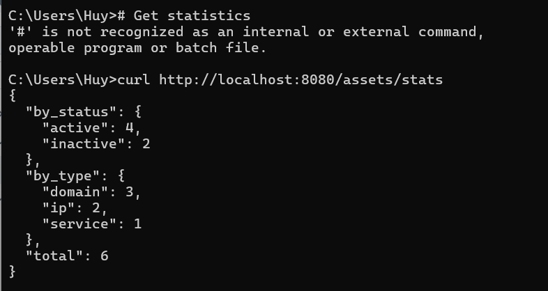

# BTVN-Nguyễn Hữu Đức Anh

```
## Các bài đã hoàn thành

- [x] Bài 1: Statistics APIs
- [x] Bài 2: Batch Create
- [x] Bài 3: Batch Delete
- [x] Bài 4: Connection Retry
- [x] Bài 5: Health Check
- [x] Bài 6: Pagination (Bonus)
- [x] Bài 7: Search (Bonus)
```

**Bài 1:**

#Get statics



#Count all


# Count by type


# Count by type and status


Bài 2:


Bài 3:


Bài 4:

- Trường hợp không connect được tới db


- Trường hợp connect thành công


Bài 5:

#Normal operation


#bị disconnect 


Bài 6:

`# Page 1, 10 items`


`# Filter by type`


`# Combine filters`


Bài 7:

#search for examples và .com


`# Case insensitive`


